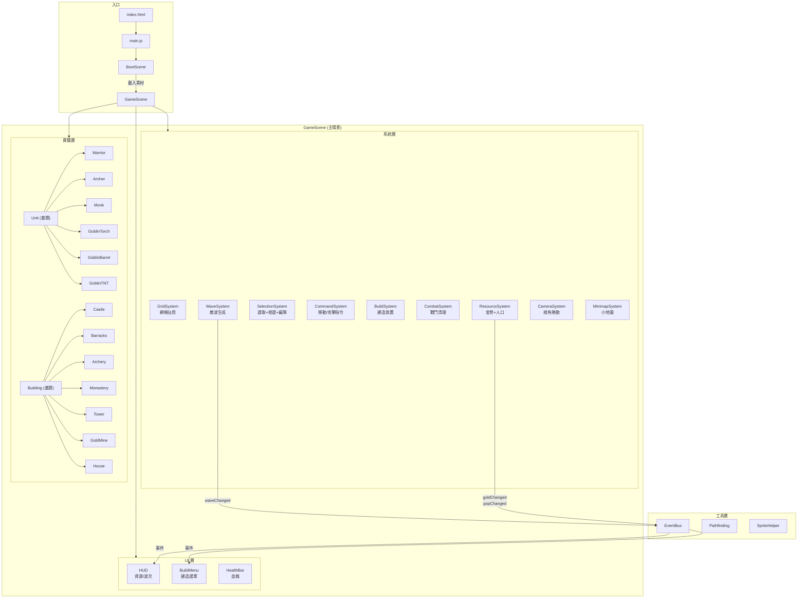
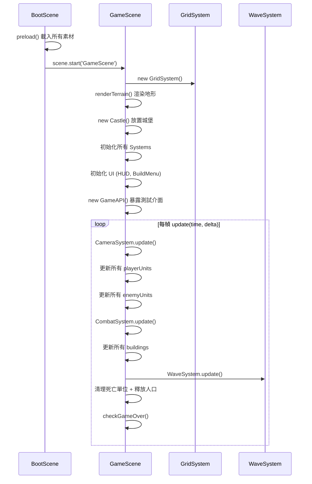
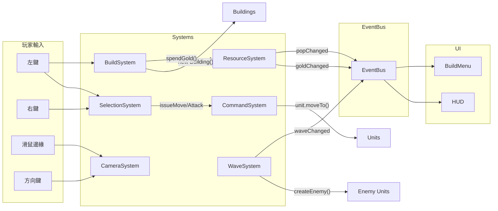
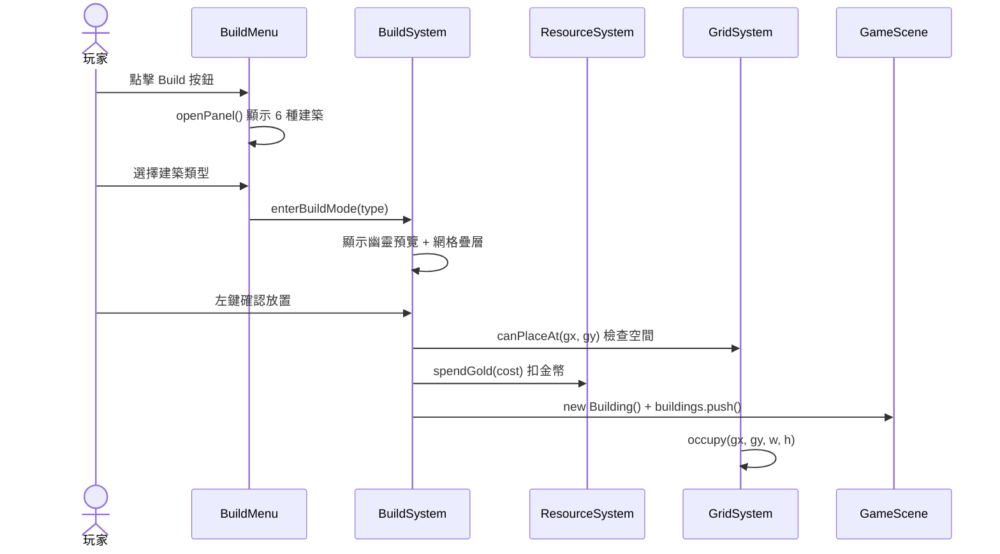
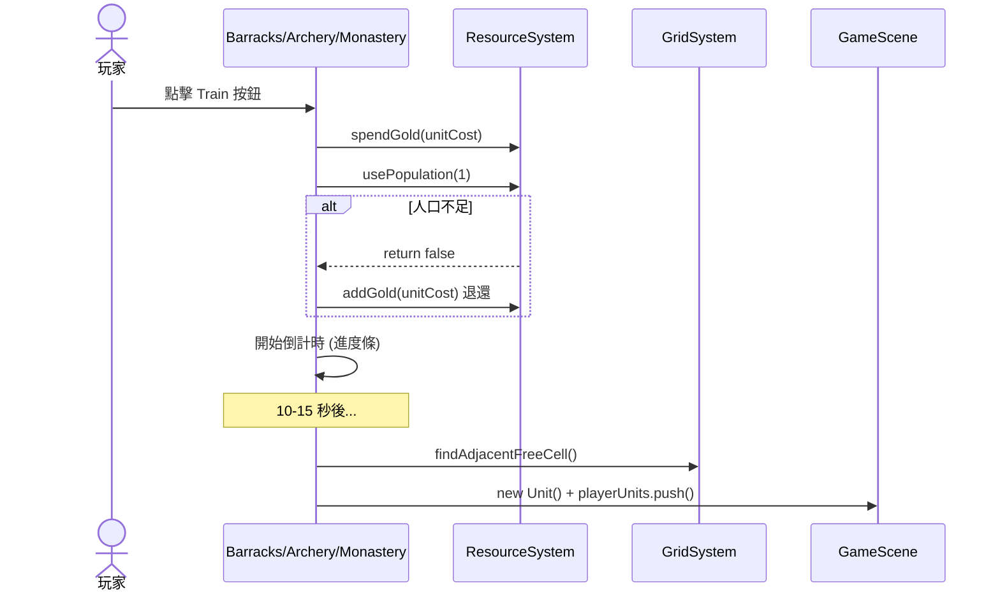
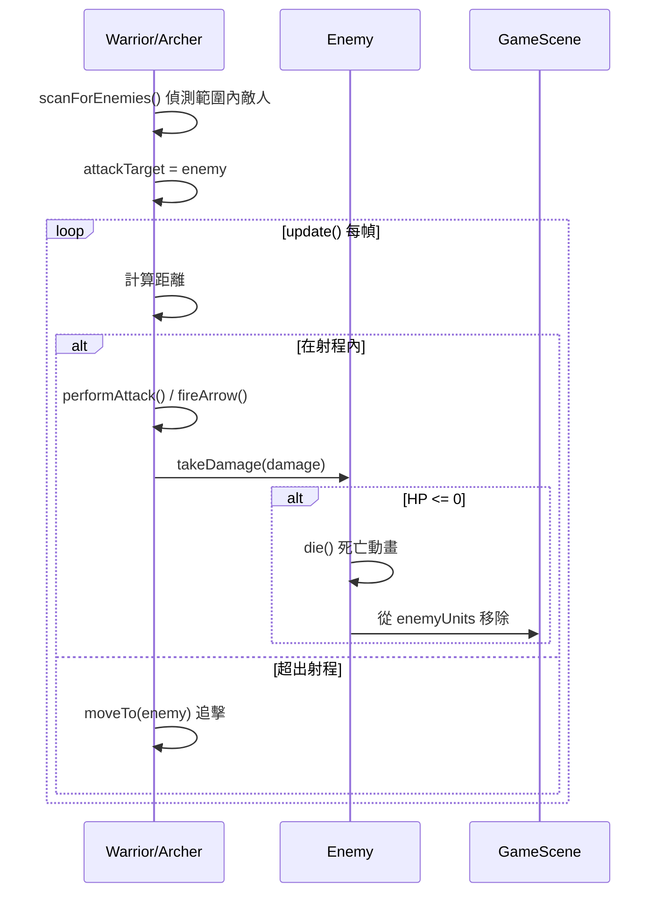
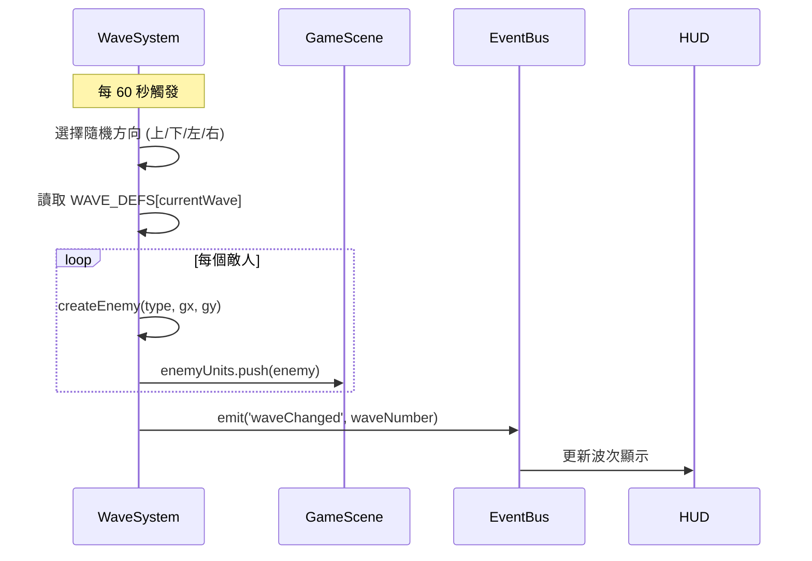
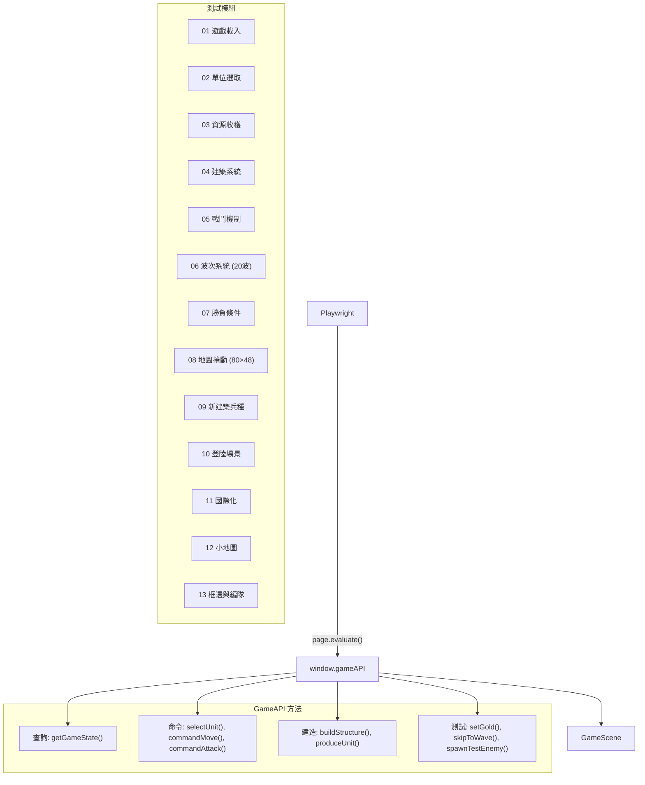

# Tiny Swords RTS — 架構文件

## 專案概述

類似星海爭霸的即時戰略防禦遊戲。玩家在地圖上建造基地、訓練兵種、抵禦 20 波哥布林進攻。

**技術棧:** Phaser 3.60 (CDN) + JavaScript ES Modules + live-server

**地圖:** 5120×3072 像素 (80×48 格, 每格 64px)
**視窗:** 1280×768 像素
**測試:** Playwright + window.gameAPI

---

## 目錄結構

```
src/
├── main.js                    # 入口，建立 Phaser Game
├── config/
│   ├── gameConfig.js          # 所有常數 (數值、成本、時間)
│   └── assetManifest.js       # 素材清單 (圖片、精靈表)
├── scenes/
│   ├── BootScene.js           # 載入所有資源
│   └── GameScene.js           # 主遊戲場景 (遊戲迴圈)
├── entities/
│   ├── Unit.js                # 單位基類
│   ├── Warrior.js             # 近戰戰士
│   ├── Archer.js              # 遠程弓箭手
│   ├── Monk.js                # 治療僧侶
│   ├── GoblinTorch.js         # 敵方近戰
│   ├── GoblinBarrel.js        # 敵方坦克
│   ├── GoblinTNT.js           # 敵方爆破
│   ├── Building.js            # 建築基類
│   ├── Castle.js              # 主城堡
│   ├── Barracks.js            # 兵營 (訓練戰士)
│   ├── Archery.js             # 射箭場 (訓練弓箭手)
│   ├── Monastery.js           # 修道院 (訓練僧侶)
│   ├── Tower.js               # 防禦塔 (自動射擊)
│   ├── GoldMine.js            # 金礦 (被動收入)
│   └── House.js               # 房屋 (人口加成)
├── systems/
│   ├── GridSystem.js          # 網格佔用、座標轉換
│   ├── ResourceSystem.js      # 金幣與人口管理
│   ├── SelectionSystem.js     # 滑鼠選取單位/建築、框選、控制編隊
│   ├── CommandSystem.js       # 移動/攻擊指令
│   ├── BuildSystem.js         # 建造模式、放置驗證
│   ├── CombatSystem.js        # 攻擊目標清理
│   ├── WaveSystem.js          # 敵波生成計時
│   ├── CameraSystem.js        # 視角捲動 (滑鼠邊緣+鍵盤)
│   └── MinimapSystem.js       # 小地圖系統 (地形、單位、視角)
├── ui/
│   ├── HUD.js                 # 金幣、人口、波次顯示
│   ├── BuildMenu.js           # 城堡建造選單 (6 項)
│   └── HealthBar.js           # 血條 UI
├── utils/
│   ├── EventBus.js            # 發布/訂閱事件系統
│   ├── SpriteHelper.js        # 動畫建立輔助
│   └── Pathfinding.js         # 8 方向 A* 尋路
└── api/
    └── GameAPI.js             # Playwright 測試介面

tests/
├── specs/                     # 13 個 Playwright 測試模組
│   ├── 01-game-loads.spec.js
│   ├── 02-unit-selection.spec.js
│   ├── 03-resource-harvest.spec.js
│   ├── 04-building.spec.js
│   ├── 05-combat.spec.js
│   ├── 06-wave-system.spec.js
│   ├── 07-win-lose.spec.js
│   ├── 08-scrollable-map.spec.js
│   ├── 09-new-buildings-units.spec.js
│   ├── 10-landing-scene.spec.js
│   ├── 11-i18n.spec.js
│   ├── 12-minimap.spec.js
│   └── 13-box-selection-control-groups.spec.js
└── helpers/
    └── gameHelper.js          # 測試輔助函數
```

---

## 架構總覽



---

## 場景生命週期



---

## 類別繼承圖

```mermaid
classDiagram
    class Unit {
        +id: string
        +hp / maxHp: number
        +speed: number
        +state: UnitState
        +attackTarget: Unit|Building
        +sprite: Phaser.Sprite
        +moveTo(px, py)
        +moveToWithPathfinding(px, py)
        +takeDamage(amount)
        +playAnim(name)
        +update(time, delta)
    }

    class Building {
        +id: string
        +hp / maxHp: number
        +gx, gy, gridW, gridH
        +sprite: Phaser.Image
        +static cost: number
        +takeDamage(amount)
        +getCenter(): {x,y}
        +onDestroyed()
    }

    Unit <|-- Warrior : 近戰 HP100 DMG15
    Unit <|-- Archer : 遠程 HP60 DMG10 Range4
    Unit <|-- Monk : 治療 HP50 Heal15
    Unit <|-- GoblinTorch : 敵方近戰 HP60
    Unit <|-- GoblinBarrel : 敵方坦克 HP150
    Unit <|-- GoblinTNT : 敵方爆破 HP30

    Building <|-- Castle : 主基地 5x4 HP1000
    Building <|-- Barracks : 訓練戰士 3x3
    Building <|-- Archery : 訓練弓箭手 3x3
    Building <|-- Monastery : 訓練僧侶 3x3
    Building <|-- Tower : 自動射擊 2x3
    Building <|-- GoldMine : 被動收入 3x2
    Building <|-- House : 人口+5 2x2
```

---

## 系統間通訊



---

## 核心資料流

### 建造建築



### 訓練單位



### 戰鬥流程



### 敵波生成



---

## 建築與兵種數值表

### 建築

| 建築 | 尺寸 | HP | 成本 | 功能 |
|------|------|-----|------|------|
| Castle | 5×4 | 1000 | — | 主基地，被毀=失敗 |
| Barracks | 3×3 | 500 | 150g | 訓練 Warrior (10s, 75g) |
| Archery | 3×3 | 500 | 175g | 訓練 Archer (12s, 60g) |
| Monastery | 3×3 | 500 | 200g | 訓練 Monk (15s, 80g) |
| Tower | 2×3 | 400 | 125g | 自動射擊 (5格射程, 12傷害, 1.5s) |
| GoldMine | 3×2 | 300 | 100g | 每 5s +25 金幣 |
| House | 2×2 | 200 | 75g | 人口上限 +5 |

### 玩家兵種

| 兵種 | HP | 速度 | 傷害 | 射程 | 冷卻 | 特殊 |
|------|-----|------|------|------|------|------|
| Warrior | 100 | 80 | 15 | 1.2格 | 1.0s | 近戰自動追擊 |
| Archer | 60 | 70 | 10 | 4格 | 1.2s | 箭矢投射物 |
| Monk | 50 | 75 | 0 | 3格 | 2.0s | 自動治療友軍 +15HP |

### 敵方兵種

| 兵種 | HP | 速度 | 傷害 | 特殊 |
|------|-----|------|------|------|
| GoblinTorch | 60 | 60 | 10 | 標準近戰 |
| GoblinBarrel | 150 | 40 | 20 | 高HP慢速坦克 |
| GoblinTNT | 30 | 50 | 80 | 一次性自爆 |

---

## 波次定義

### 第一階段：學習期 (Wave 1-5)

| 波次 | Torch | Barrel | TNT | 總數 |
|------|-------|--------|-----|------|
| 1 | 3 | — | — | 3 |
| 2 | 5 | — | — | 5 |
| 3 | 4 | 2 | — | 6 |
| 4 | 5 | 3 | — | 8 |
| 5 | 4 | 2 | 1 | 7 |

### 第二階段：成長期 (Wave 6-10)

| 波次 | Torch | Barrel | TNT | 總數 |
|------|-------|--------|-----|------|
| 6 | 6 | 3 | 2 | 11 |
| 7 | 8 | 4 | 2 | 14 |
| 8 | 6 | 4 | 3 | 13 |
| 9 | 10 | 5 | 2 | 17 |
| 10 | 12 | 6 | 4 | 22 |

### 第三階段：快速期 (Wave 11-15)

| 波次 | Torch | Barrel | TNT | 總數 |
|------|-------|--------|-----|------|
| 11 | 18 | 9 | 6 | 33 |
| 12 | 20 | 10 | 7 | 37 |
| 13 | 22 | 12 | 8 | 42 |
| 14 | 25 | 14 | 9 | 48 |
| 15 | 28 | 16 | 10 | 54 |

### 第四階段：極限挑戰 (Wave 16-20)

| 波次 | Torch | Barrel | TNT | 總數 |
|------|-------|--------|-----|------|
| 16 | 35 | 20 | 12 | 67 |
| 17 | 40 | 24 | 14 | 78 |
| 18 | 45 | 28 | 16 | 89 |
| 19 | 50 | 32 | 18 | 100 |
| 20 | 60 | 40 | 22 | 122 |

---

## 勝負條件

- **勝利:** 20 波全部生成 + 所有敵人死亡
- **失敗:** Castle HP 降到 0

---

## 新增功能特性

### 小地圖系統 (MinimapSystem)

- **位置:** 螢幕右下角，大小 200×120 像素
- **顯示內容:**
  - 地形顏色（草地綠、水藍、樹棕、山灰）
  - 友方單位/建築（藍色點）
  - 敵方單位（紅色點）
  - 視角框（白色矩形）
- **互動:**
  - 點擊小地圖快速移動視角
  - M 鍵切換顯示/隱藏
- **實作:** 使用 RenderTexture 繪製地形，每幀更新單位點位

### 框選系統 (Box Selection)

- **操作:** 左鍵拖曳畫出選取框
- **視覺:** 半透明藍色矩形框
- **功能:** 一次選取範圍內所有友方單位
- **實作:** 在 SelectionSystem 中監聽 pointerdown/move/up，計算矩形與單位碰撞

### 控制編隊 (Control Groups)

- **建立編隊:** Ctrl + 數字鍵 (1-9)
- **選取編隊:** 數字鍵 (1-9)
- **容量:** 9 個編隊，每個編隊可包含多個單位
- **清理:** 單位死亡時自動從編隊移除
- **實作:** SelectionSystem 維護 controlGroups Map，監聽鍵盤事件

### 隨機地圖生成

- **地圖數量:** 10 種預設地圖
- **地形類型:**
  - 草地 (Grass) — 可行走
  - 樹木 (Trees) — 不可行走
  - 水域 (Water) — 不可行走
  - 山地 (Mountains) — 不可行走
- **生成方式:** LandingScene 選擇隨機地圖，傳遞給 GameScene
- **佈局:** 每張地圖有不同的地形分布，城堡位置固定居中

---

## 測試架構



**執行測試:**
```bash
npm run dev          # 啟動 live-server (port 8081)
npm test             # 執行所有 Playwright 測試
```
